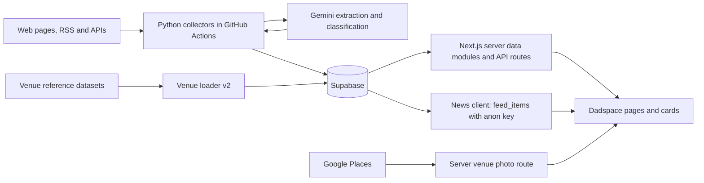

# Dadspace architecture

Updated 5 October 2026 against main commit `29275e17dab42804ecebec529dda2f596ea6cdc7`.

## System

Dadspace is a Next.js/React application backed by Supabase. Python collectors run in GitHub Actions, fetch external content or reference datasets, and write curated records to the database. Gemini assists content extraction and classification. The app reads those records for venues, events, activities, news and deals.

## Application boundaries

- `lib/events.ts`, `lib/activities.ts` and `lib/venues.ts` implement listing reads and filtering. Location helpers support distance ordering.
- `lib/data.ts` assembles homepage data, including `upcoming_events` and `feed_items`. Some homepage sections have sample fallbacks; the top deal is still sample content in this baseline.
- `app/deals/page.tsx` reads up to 60 rows from `deals` where status is live and revalidates every 900 seconds.
- `lib/news.ts` reads the public `feed_items` view with an anon key, returning summaries and metadata rather than full article text.
- `lib/supabase.ts` is server-only and uses the service role key when configured, falling back to the public anon key. Its listing callers select data. A service role read bypasses RLS, so application filters remain necessary.
- `lib/supabase/client.ts`, `server.ts` and `proxy.ts` support authentication separately from collector credentials.

## Launch state

`lib/launch.ts` sets `COMING_SOON = true`. The root page and proxy serve the holding experience; matched page requests are rewritten to the root. The proxy matcher excludes API routes and listed static resources, so the holding page is not an API access-control boundary.

`app/forum/page.tsx` is a Coming Soon placeholder. Homepage thread data/sample cards do not establish a working forum. Live rooms, message subscriptions and moderation are future work.

## Data model

| Object | Responsibility |
| --- | --- |
| sources | Event/activity source configuration and reference source enablement |
| collected_events | Shared event and recurring-activity storage; listing_type distinguishes records |
| upcoming_events | Homepage event read view |
| current_activities | Recurring activities seen within the freshness window |
| venues | Canonical facility records and public visibility |
| venue_sources | Reference dataset provenance and matched source identity |
| venues_to_review | Restricted review view for discovered or flagged venues |
| news_sources / news_items / feed_items | News configuration, stored items and public feed |
| deal_sources / deals | Offer sources and stored offer lifecycle |
| parent_discount_items / parent_deal_exclusions | Database-driven deal relevance rules |
| pipeline_runs | Run diagnostics for collectors that implement logging |
| forum_threads | Existing placeholder data; no active forum UI |

Schema evidence lives in `supabase/migrations/` and supporting SQL files. Not every deployed table/view definition is captured in this checkout. Do not infer live grants or policies from names alone.

## Images

Existing venue images take priority. Google references use `google-places:<place-id>` in `image_url` and are resolved through the server photo route when cards enter the viewport. Google keys stay on the server; category artwork provides a fallback. See [the photo guide](venue-google-photos.md).

## Current limitations

Activity source coverage and deal usefulness require further work. The ongoing deals changes in another chat are excluded from this committed baseline. Venue discovery and publication rules differ by loader, as described in [data flows](data-flows.md). This documentation does not certify production readiness or the current deployment revision.
