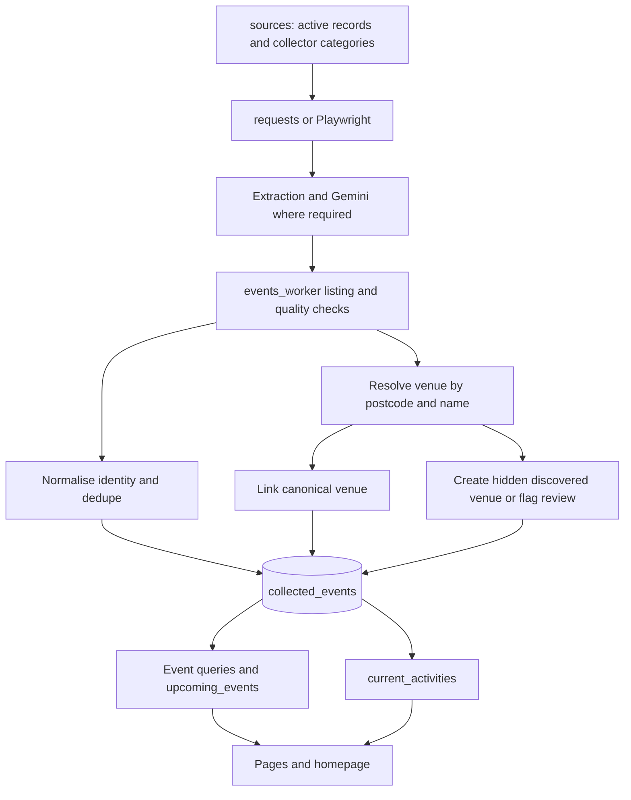

# Dadspace data flows

Updated 5 October 2026 against main commit `29275e17dab42804ecebec529dda2f596ea6cdc7`.

## Events and recurring activities

A dated event and a repeating class have different identities. The wrapper builds event keys from normalised title, date and location; activity keys use normalised title and venue/location. Upserts use `dedupe_key`; repository migrations add supporting event identity handling.

Both types remain in `collected_events`. `listing_type='activity'` identifies recurring listings. The repository defines `current_activities` as activity rows seen in the last 60 days; subsequent migrations handle last-seen refresh. The dedicated NCT loader also upserts shared listing records. Read-side sorting/filtering is separate from ingestion.

Extraction quality rules include family/audience suitability, explicit schedules, suspicious times, seasonal/date consistency and holiday-camp handling. These checks reduce bad records; they do not verify every listing with its operator.

The generic pipeline tracks page/source state and can avoid unnecessary extraction on unchanged content. Review freshness and the last-seen trigger before treating a skipped extraction as stale data.

## Venue discovery, reconciliation and publication

`venues` is canonical. Event/activity venue resolution matches existing records before inserting and avoids automatically adding schools as new venues. Newly discovered venues use `public_visible=false`, `discovery_status='discovered'` and a review reason.

The active reference loader has separate rules:

| Input | Existing match | Unmatched record |
| --- | --- | --- |
| Active Places | Enrich missing fields and attach provenance | No new venue inserted by v2 |
| Public Library reference CSV | Enrich and attach provenance | Insert/upsert verified, public library |
| Event/activity extraction | Link existing venue; ambiguity can flag review | Insert hidden discovered venue when eligible |

`venue_sources` preserves external source identity and match information. Ambiguous postcode/fuzzy-name reference matches are flagged rather than confidently linked.

The app reads only `public_visible=true` venues. The restricted `venues_to_review` view selects discovered or flagged rows. No end-to-end automated validation service or review UI is established by these files. A decision to publish a discovered venue must be supported by an operational review process; library auto-publication is the explicit v2 exception.

Museum imports and other one-off backfills are separate from the scheduled reference worker and should retain their own import reports.

## News

`news_sources` → fetching → Gemini classification/summaries → `news_items` upsert by URL → story grouping/primary selection → `feed_items` → news page and homepage.

Before saving relevant articles, `news_links.py` attempts to resolve Google News wrapper links to original publisher URLs; failed resolution preserves the original link.

The worker checks for region and story grouping fields, updates source health, implements retention cleanup and logs runs. The news client reads summaries, relevance, category and region. Nation filters include UK-wide stories. The exact deployed view definition must be inspected separately if feed publication logic is being changed.

## Deals

`deal_sources` plus `parent_discount_items` and `parent_deal_exclusions` → source-specific adapters → filtering/classification → review files → live `deals` upsert by dedupe key.

Live runs update source health and mark sufficiently old unseen live offers expired. Dry runs generate review output without saving offers; inspect each worker's diagnostics separately before assuming no database writes at all.

The committed deals page reads live offers directly. The homepage top deal is sample content in this baseline. The ongoing quality and shared-selection changes are pending and must not be described as already available.

## Location and photos

Browser location/postcode input and location APIs feed coordinates into listing distance helpers; events and activities can be ordered by proximity. Stored venue coordinates and geocoded location text support this flow. Missing coordinates can limit useful distance ranking.

For venue photos: existing image → verified Google Place reference → category fallback. The browser requests the server photo route; fresh Google photo metadata and attribution are resolved on demand. See [photo documentation](venue-google-photos.md).

## Access and observability

Collectors use private database credentials in GitHub Actions. Listing server modules can use service-role reads; news uses anon reads. RLS, view configuration, grants and application filters therefore have distinct roles.

`pipeline_runs`, source health fields, workflow logs and review artifacts provide evidence of ingestion. A successful workflow alone does not establish fresh, useful coverage or public visibility. Verify actual rows and read paths when diagnosing an empty page.
