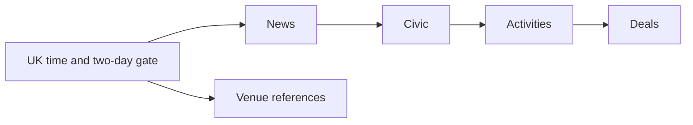

# Dadspace worker roles

Updated 5 October 2026 against main commit `29275e17dab42804ecebec529dda2f596ea6cdc7`.

Business responsibility determines the worker role; fetch technology is a separate choice. Both generic collectors can extract dated events and recurring activities.

| Role | Workflow | Actual entry point | Responsibility |
| --- | --- | --- | --- |
| News | news.yml | news_worker.py | Fetch configured news sources, classify/summarise, store and group news |
| Civic/event collector | collect-civic.yml | events_worker.py | Councils, heritage/parks and niche venue pages; requests fetch engine |
| Activities/browser collector | collect-activities.yml | events_worker.py | Activities/clubs sources; browser/Playwright fetch engine |
| NCT activities | nct-activities.yml | nct_activity_loader.py | Dedicated NCT branch extraction into shared listing storage |
| Venue references | venue-reference.yml | venue_reference_loader_v2.py | Reconcile Active Places and Public Library reference records |
| Deals | deals_collect.yml | deals_worker_db.py | Database-driven relevance rules and source adapters, reviews and offer writes |
| Venue photo matching | venue-google-photos.yml | scripts/backfill-venue-photos.mjs | Manual identifier-based Google matching for missing images |

Workflow paths are under `.github/workflows/`. `worker.py` remains the generic fetching, source selection, retries, extraction metrics and upsert engine. `events_worker.py` wraps it with listing classification, quality checks and venue resolution without adding another Gemini call.

## Schedule and dependencies

`daily-workers.yml` triggers at 06:00 and 07:00 UTC each day. A gate allows only hour 07 in Europe/London and every second calendar day from 1 October 2026. Manual dispatch bypasses the time and day gates. GitHub delivery may be delayed; this is a gate on actual run time, not a guaranteed start time.

The downstream chain requires upstream success. News failure can therefore skip civic, activities and deals; civic failure can skip activities and deals. Venue reference failure does not block that chain. Scheduled calls explicitly request live writes.

`collect-all.yml` is a manual civic-then-activities orchestrator, with dry run defaulting to true. NCT and Google photo matching are not called by the daily orchestrator. NCT runs manually or on a matching main-branch file change; venue references also have a matching push trigger.

## Venue reference implementation

The scheduled entry point is loader v2, not `venue_reference_worker.py`. The older worker remains in the repository and its hidden-new-venue policy does not describe every v2 path.

Loader v2 reads active reference source names from `sources`, matches existing venues using postcode/name evidence, fills missing fields and records `venue_sources` provenance. Uncertain fuzzy matches set a review reason.

Active Places enriches matched venues and does not insert unmatched records. New reference libraries are upserted with `discovery_status='verified'` and `public_visible=true`. Its counter label `hidden_or_existing` is misleading for these new rows. Event/activity discovery instead creates hidden records pending review.

## Source metadata

`sources.source_role` defines event_listing, activity_listing or venue_reference responsibility; `source_adapter` identifies specialised handling. The generic collectors also use workflow-selected categories and fetch-engine settings. Do not assume source_role alone routes every source.

NCT has a dedicated loader in this baseline; the earlier suggestion to wait for a future generic NCT adapter is superseded.

## Supporting workflows

`events-activities-baseline.yml` produces read-only backup, cleanup preview and fixed-source extraction baselines when matching PR paths change. `check_hukd_feed.yml` is a diagnostic workflow, not the main deals collector. Review workflow triggers before manually running them; names alone do not establish dry-run behaviour.
